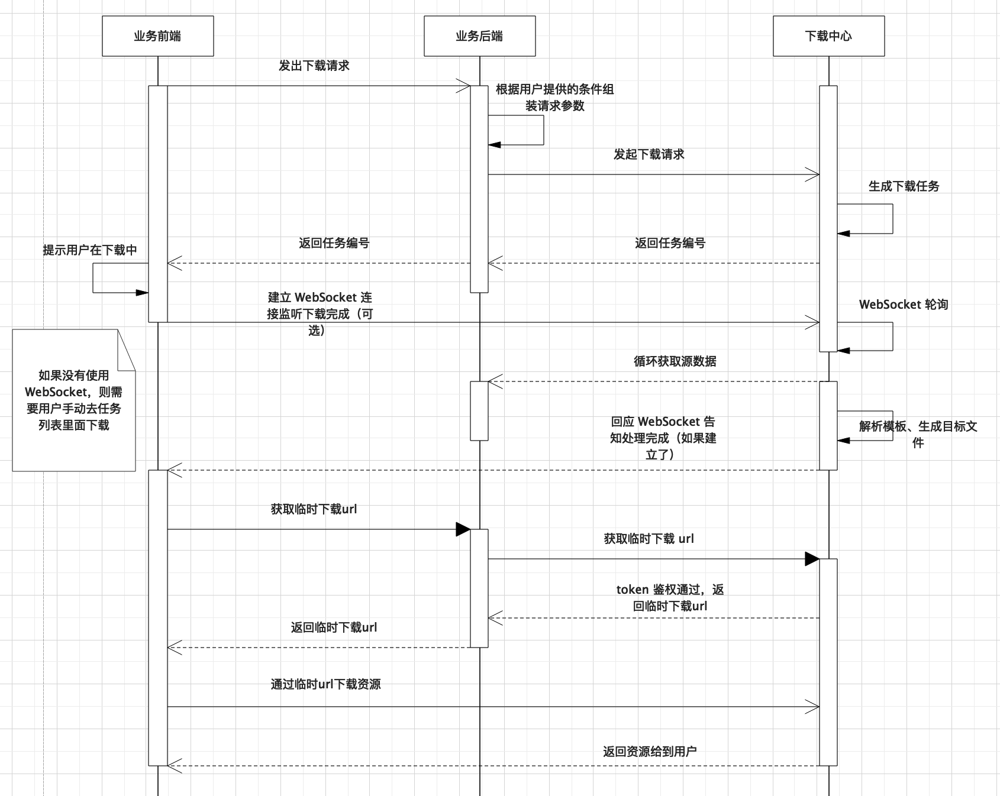
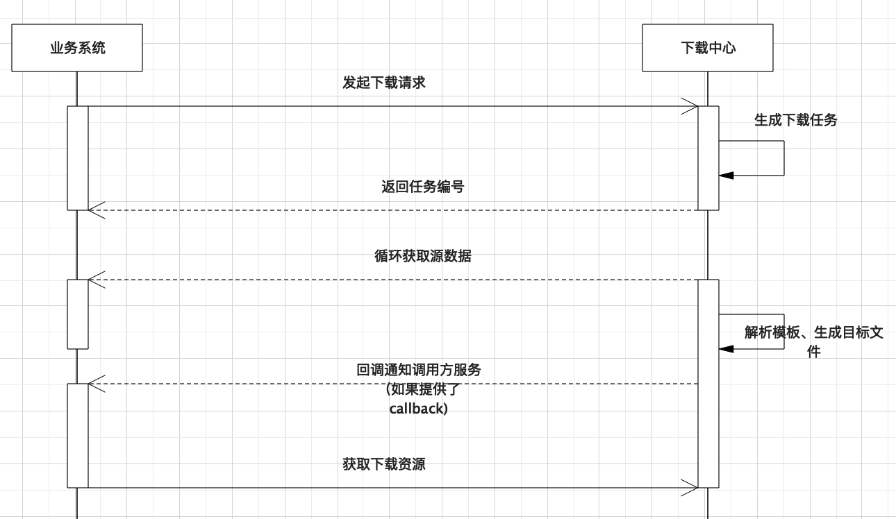
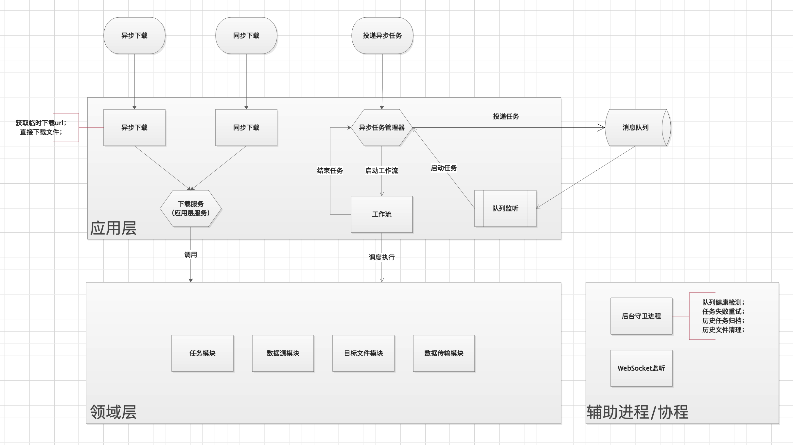

# 下载中心说明文档

### 目标
下载中心需要实现如下目标：

- 通用。可供商户平台、卡管理后台、OS 甚至是第三方使用；
- 支持**同步**和**异步**两种下载模式。同步用来下载小数据量文件，异步下载大数据量文件；
- 支持 **csv** 和 **excel** 格式的下载需求；
- 可通过配置 excel 模板定制复杂的 excel 格式；
- 安全性。相关接口请求需要鉴权；
- 合理的反馈机制。实现三种反馈机制：
    - **异步回调：**调用方提交任务时提供 callback，下载中心任务完成时通知对方，一般用于对方是后台程序下载的情况；
    - **WebSocket 查询：**调用方提交任务后建立到下载中心的 WebSocket 连接，下载中心任务完成后回复 WebSocket 客户端；
    - **被动查询：**根据 project_id、task_id 查询任务（列表）；
- 支持**前端**（浏览器）和**后端**（后台服务）两种数据下载模式。前端下载通过下载中心提供的临时下载 url 下载数据，后端则在鉴权后通过永久 url 下载数据；

### 使用方式

#### 异步下载：
**场景：**业务需要下载的数据量可能较大时，同步下载模式会导致浏览器请求超时，此时建议采用异步下载模式。
这里分别讨论用户（浏览器）下载和系统下载两种场景。

**用户在浏览器异步下载：**

**说明：**

1. 用户点击“下载”按钮触发下载；
2. 浏览器向业务后台发出下载请求；
3. 业务后台组装请求数据，向下载中心投递下载任务（该 API 需要 token 鉴权）；
4. 下载中心生成下载任务，并返回任务编号返回给业务后台；
5. 业务后台将获取到的任务编号返回给浏览器；
6. 浏览器告知用户正在下载中，完成下载后将提示您（或者稍后请去某地方查看下载结果——针对不建立 WebSocket 连接的情况）；
7. 下载中心异步处理下载任务（从数据源拉取数据、解析模板、生成目标文件等）；
8. 下载中心任务处理完成后，通知 WebSocket 客户端（如果有），或者浏览器轮询，或者用户手动刷新查看任务状态；
9. 浏览器感知到任务处理完成，向业务后端请求临时下载地址（由于生成下载地址需要 token 鉴权，必须由后端去请求下载中心）；
10. 业务后端请求下载中心获取临时下载地址；
11. 下载中心返回临时下载 url 给业务后端，5 分钟有效期；
12. 业务后端将临时下载 url 返回给前端；
13. 前端使用临时下载 url 下载数据；

**注意：**

- *此处为何要由前端（浏览器）通过临时 url 下载数据，而不是由业务后端直接从下载中心下载数据返回给前端？*

  原因是需要下载的数据可能很大（可能有几百兆），如果由业务后端直接下载，则业务后端必须实现大数据下载的代码逻辑（通过本地临时文件中转），否则直接把数据放入内存，会导致内存溢出。由浏览器通过临时 url 直接根下载中心交互，省去了业务后台的复杂性。

- *浏览器端可以不建立 WebSocket 连接吗？*

  可以。浏览器端可以采用主动方案或者被动方案。主动方案中浏览器和下载中心建立 WebSocket 连接，下载中心处理完毕后主动通知浏览器执行下载。

  被动方案中浏览器不建立 WebSocket 连接，而是告诉用户稍后可以去哪里查看下载结果。

  无论采用主动方案还是被动方案，建议都要有一个统一的地方可以查看下载任务的处理结果，因为主动方案中， WebSocket 连接可能会断开（比如关闭了页面），或者由于数据量太大，用时较长，用户关闭了浏览器重新打开，应该仍然能够获取得到下载的数据。

- 此模式下业务后端需要提供三个 API，其中两个给前端用，一个给下载中心用：

  - 数据下载请求（任务投递）接口，给前端用；
  - 获取临时下载 url 接口，给前端用；
  - 分页获取源数据接口，给下载中心用；

**后台系统（程序）异步下载：**

**说明：**

这种模式一般用在系统间数据批量同步上，一般生成 csv 文件。也可以通过这种方式为第三方提供数据同步功能。

1. 业务系统（后端程序）投递下载任务，并在请求参数中带上 callback 参数；
2. 下载中心生成下载任务，并返回任务编号（业务系统可保存也可忽略）；
3. 下载中心异步处理下载任务；
4. 任务处理完毕，下载中心通过 callback 通知业务系统任务处理完毕，可下载了；
5. 业务系统从下载中心下载数据；

**注意：**

此模式下，业务后端需要考虑数据量问题，如果生成的文件很大，则不能一次全放入内存中，而要写入到临时文件中，防止内存溢出（PHP 可使用 `curl` 的 `CURLOPT_WRITEFUNCTION`实现）。

#### 同步下载：

当能预判数据量不会太大时，可以使用同步下载模式。

**说明：**

此模式只需要调一个接口，实现简单，一般用来简化业务后端下载逻辑处理（生成符合格式要求的 excel）。

**注意：**如果不能保证未来数据量不会不可控地增长，请不要用这种模式，防止出现崩溃。

### 技术架构：

